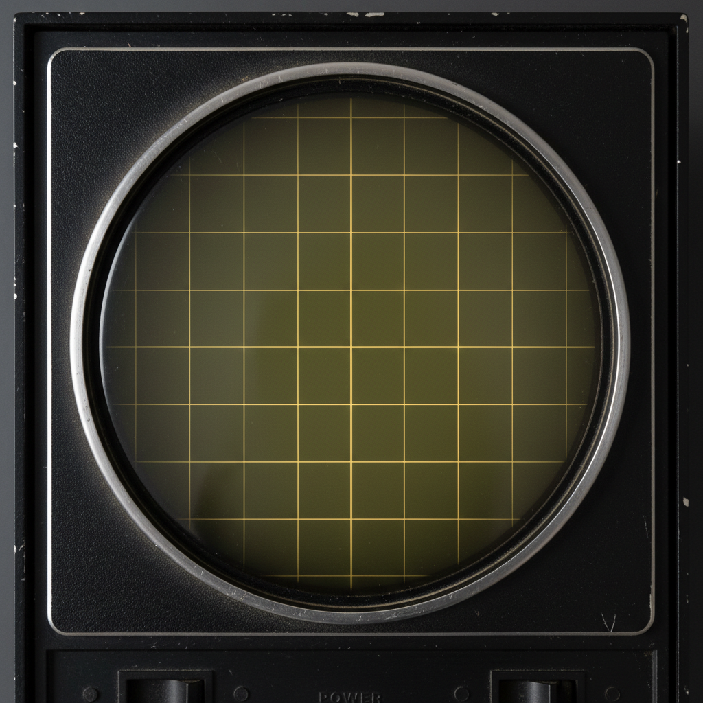

# WJ-8000

A software emulation of the Korg DW-8000 synthesizer, built as an audio plugin using the JUCE framework.



## Overview

WJ-8000 faithfully recreates the architecture of the Korg DW-8000 — an 8-voice digital/analog hybrid synthesizer from 1985. It features DWGS (Digital Waveform Generator System) oscillators, an analog-modeled NJM2069 low-pass filter, a full ADBSSR envelope, a KLM-775 digital delay emulation, an LFO modulation generator, and an arpeggiator — all with complete SysEx compatibility for loading real DW-8000 patch banks.

## Features

- **8-voice polyphony** with Poly1, Poly2, Unison 1, and Unison 2 key-assign modes
- **DWGS Oscillators** — two oscillators each with 16 waveforms sampled from the original hardware, selectable octave (16'/8'/4'), and per-voice level control
- **Oscillator 2 interval & detune** — up to ~25 cents detune, harmonic intervals (minor 3rd, major 3rd, P4, P5), and noise source
- **Auto Bend** — per-oscillator pitch bend with configurable direction, time, and intensity
- **NJM2069 Filter** — analog-modeled 4-pole low-pass VCF with cutoff, resonance, keyboard tracking, and EG polarity control
- **ADBSSR Envelope** — Attack, Decay, Break Point, Slope Time, Sustain, and Release for both VCF and VCA
- **MG (Modulation Generator)** — LFO with multiple waveforms routable to pitch and/or VCF
- **KLM-775 Digital Delay** — mono delay (2ms–512ms) with LFO modulation for chorus/flange effects, feedback, and wet level control
- **Arpeggiator** — Up/Down and Assignable modes, 1/2/Full octave range, latch, internal tempo or MIDI clock sync
- **64-preset bank** (8 banks × 8 programs) displayed as 11–18, 21–28, … 81–88
- **SysEx compatibility** — load and save `.syx` bank files in both raw (64 × 57 bytes) and hardware dump (64 × 66 bytes) formats
- **Embedded factory bank** loaded on startup

## Plugin Formats

| Format     | Support |
|------------|---------|
| AU         | macOS   |
| VST3       | macOS   |
| Standalone | macOS   |

## Requirements

- macOS 12.0 or later (arm64)
- CMake 3.22+
- C++20 compiler (Apple Clang recommended)
- JUCE (included as a submodule in the `JUCE/` directory)

## Building

```bash
# 1. Clone with submodules
git clone --recurse-submodules <repo-url>
cd DW8000

# 2. Configure
cmake -B build -DCMAKE_BUILD_TYPE=Release

# 3. Build
cmake --build build --config Release
```

The built plugins are automatically copied to the system plugin folders after a successful build (`COPY_PLUGIN_AFTER_BUILD TRUE`).

## Project Structure

```
DW8000/
├── Source/
│   ├── PluginProcessor.{cpp,h}      # AudioProcessor — MIDI, preset bank, state
│   ├── PluginEditor.{cpp,h}         # JUCE GUI editor
│   ├── Synth/
│   │   ├── DW8000Engine.{cpp,h}     # 8-voice render engine
│   │   ├── DW8000Voice.{cpp,h}      # Per-voice signal path
│   │   ├── DW8000Patch.{cpp,h}      # 51-parameter patch struct (SysEx-mapped)
│   │   ├── DW8000MG.{cpp,h}         # Modulation generator (LFO)
│   │   ├── DW8000Delay.{cpp,h}      # KLM-775 digital delay emulation
│   │   ├── DW8000Arpeggiator.{cpp,h}
│   │   ├── DWGS/
│   │   │   ├── DWGSWavetableBank    # 16-waveform wavetable bank
│   │   │   └── DWGSOscillator       # Wavetable oscillator with pitch interpolation
│   │   ├── Filter/
│   │   │   └── NJM2069.{cpp,h}      # Analog filter model
│   │   └── Envelope/
│   │       └── ADBSSR.{cpp,h}       # Attack-Decay-BreakPoint-Slope-Sustain-Release
│   ├── MIDI/
│   │   └── DW8000SysEx.{cpp,h}      # SysEx encode/decode
│   └── UI/
│       └── Sections/                # UI panel components
├── Resources/
│   ├── Factory/FactoryBank.syx      # Embedded 64-preset factory bank
│   ├── Images/KEYS.png              # Keyboard graphic
│   └── Wavetables/DW8000 1–16.wav  # Sampled DWGS waveforms
├── JUCE/                            # JUCE framework (submodule)
└── CMakeLists.txt
```

## SysEx Format

Patches use the standard Korg DW-8000 SysEx Data Dump format:

```
F0 42 3n 03 40 [51 bytes of patch data] F7
```

where `n` is the MIDI channel (0–15). Bank files may be either:
- **Raw format**: 64 concatenated 57-byte Data Dump messages
- **Hardware format**: 64 × 66-byte blocks — `[C0 prog][57-byte DataDump][7-byte WriteReq]`

## License

Personal study project. Not affiliated with or endorsed by Korg Inc.
